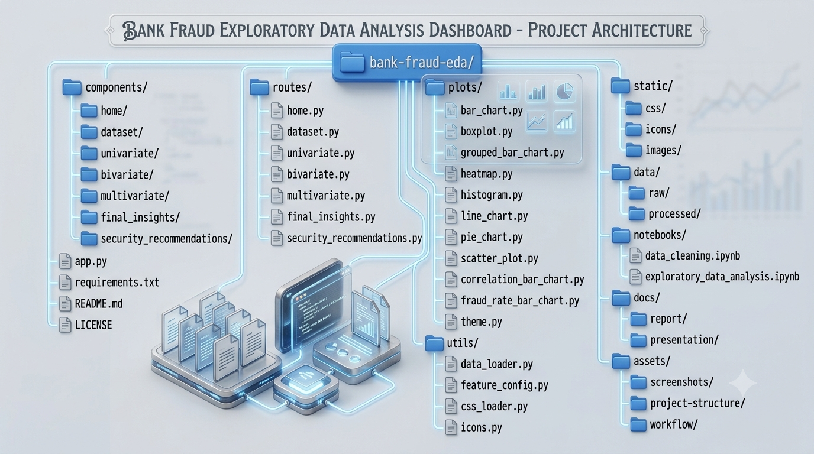
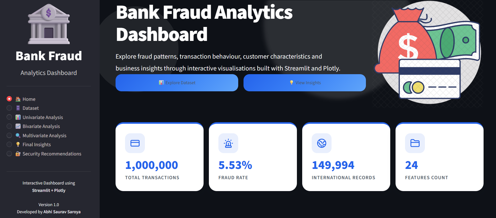
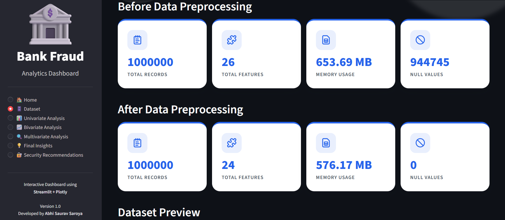
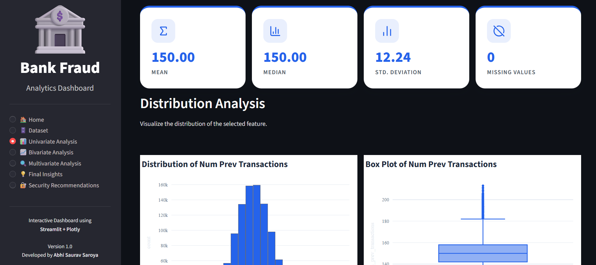
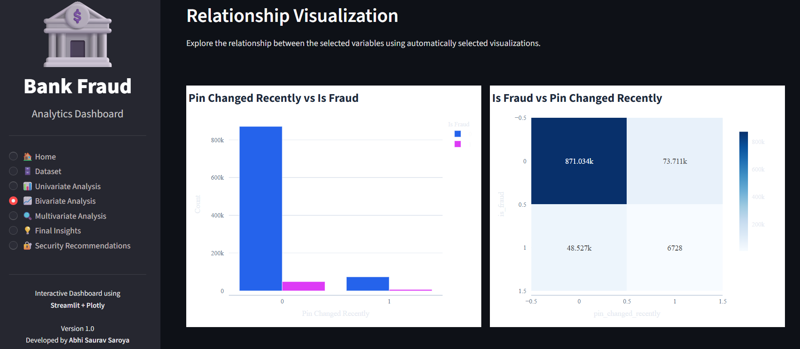
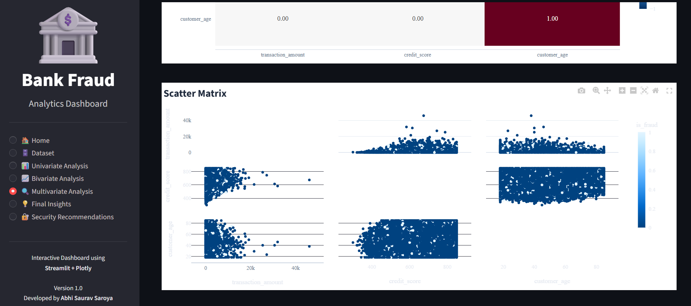
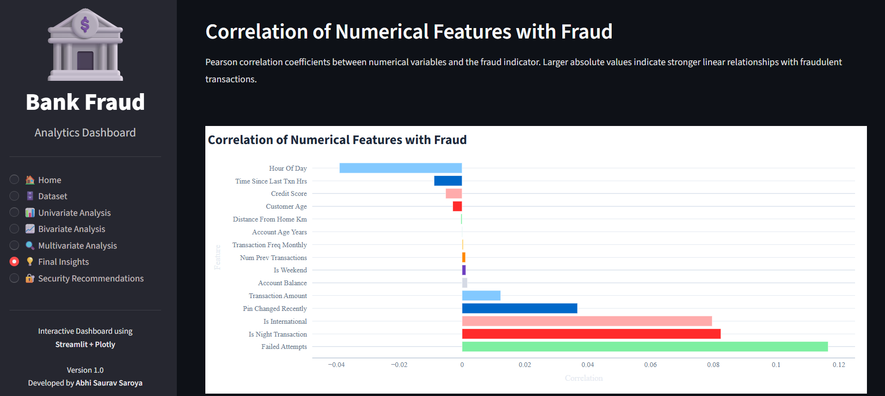
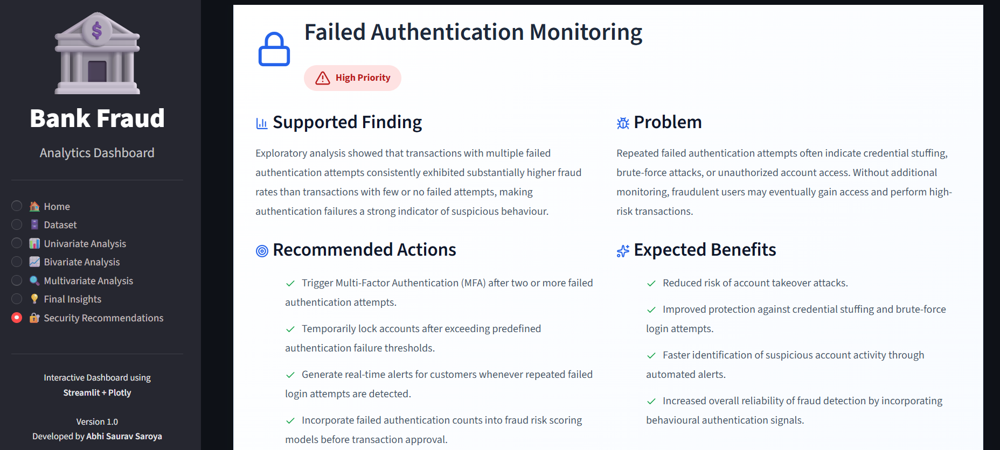
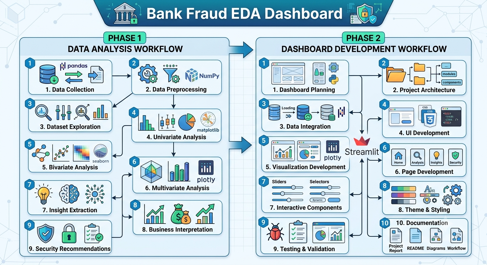

<h1 align="center">
  
</h1>

<p align="center"><i>Transforming transaction data into actionable fraud intelligence.</i></p>

---

The **Bank Fraud Exploratory Data Analysis (EDA) Dashboard** is an interactive data analytics application built using **Python**, **Streamlit**, and **Plotly** to explore fraud patterns within banking transactions.

Rather than focusing on predictive modeling, this project emphasizes **Exploratory Data Analysis (EDA)** to uncover meaningful insights, visualize transaction behaviour, identify high-risk fraud indicators, and generate data-driven security recommendations.

The dashboard provides an intuitive interface for navigating through multiple levels of analysis—from dataset exploration and feature distributions to relationship analysis, multivariate comparisons, business insights, and practical fraud prevention strategies.

> **Note:** This project focuses exclusively on exploratory data analysis and visualization. Machine Learning models are intentionally excluded and proposed as future work.

---

<p align="center">
  
  
  
</p>

<p align="center">
  
  
  
  
</p>

<p align="center">
  
  
</p>


# Features

### 📊 Interactive Dashboard

- Modern multi-page Streamlit dashboard
- Interactive Plotly visualizations
- Dynamic feature selection
- Real-time statistical summaries

### 📁 Dataset Exploration

- Dataset overview
- Feature explorer
- Column information
- Data preview

### 📈 Univariate Analysis

- Histograms and Box plots
- Frequency bar charts and Pie charts
- Automatic statistical summaries

### 📉 Bivariate Analysis

- Numerical vs Numerical analysis
- Numerical vs Categorical analysis
- Categorical vs Categorical analysis
- Relationship summaries

### 📊 Multivariate Analysis

- Compare multiple features simultaneously
- Fraud-focused visualizations
- Feature-wise fraud rate comparison
- Interactive comparison charts

### 💡 Final Insights

- Correlation with fraud
- Fraud rate by failed authentication attempts
- Fraud rate by hour of day
- Domestic vs International fraud analysis
- Merchant category fraud analysis
- PIN change behaviour analysis

### 🛡️ Security Recommendations

- Time-Based Fraud Detection
- Failed Authentication Monitoring
- Merchant Category Risk Scoring
- Cross-Border Transaction Security
- PIN Change Verification Policy

# Project Architecture

<p align="center">
  
</p>

The project follows a modular architecture where each dashboard page, reusable component, visualization, utility, and styling module is organized independently. This structure improves readability, maintainability, and scalability while encouraging component reuse throughout the application.

# Dashboard Screenshots

### 🏠 Home Page

<p align="center">
  
</p>

### 📁 Dataset Explorer

<p align="center">
  
</p>

### 📈 Univariate Analysis

<p align="center">
  
</p>

### 📉 Bivariate Analysis

<p align="center">
  
</p>

### 📊 Multivariate Analysis

<p align="center">
  
</p>

### 💡 Final Insights

<p align="center">
  
</p>

### 🛡️ Security Recommendations

<p align="center">
  
</p>

# Tech Stack

<div align="center">

| Component | Technology |
|-----------|------------|
| Programming Language | Python 3 |
| Dashboard Framework | Streamlit |
| Data Manipulation | Pandas |
| Numerical Computing | NumPy |
| Interactive Visualization | Plotly |
| Static Visualization | Matplotlib & Seaborn |
| Version Control | Git & GitHub |

</div>

# Exploratory Data Analysis Workflow

The project follows a structured exploratory data analysis pipeline to transform raw transaction records into meaningful business insights.

### 1. Data Collection

- Import banking transaction dataset
- Validate data integrity
- Inspect dataset dimensions
- Review feature descriptions

### 2. Data Cleaning

- Handle missing values
- Remove unnecessary columns
- Correct data types
- Prepare features for analysis

### 3. Feature Exploration

- Numerical feature analysis
- Categorical feature analysis
- Binary feature analysis
- Statistical summaries

### 4. Univariate Analysis

Study each feature independently using descriptive statistics and visualizations.

### 5. Bivariate Analysis

Analyze relationships between pairs of variables to uncover potential fraud patterns.

### 6. Multivariate Analysis

Compare multiple features simultaneously against the fraud target variable to identify combined behavioural trends.

### 7. Insight Generation

Extract meaningful observations from the exploratory analysis.

### 8. Security Recommendations

Translate analytical findings into practical fraud prevention strategies.


# Project Workflow

<p align="center">
  
</p>

# Installation & Setup

### Prerequisites

Before running the project, ensure you have:
- Python 3.10 or later
- Git
- pip

### Clone the Repository

```bash
git clone https://github.com/abhi-saurav-saroya/bank-fraud-eda.git
cd bank-fraud-eda
```

### Create a Virtual Environment (Recommended)

#### Windows

```bash
python -m venv venv
venv\Scripts\activate
```

#### Linux / macOS

```bash
python3 -m venv venv
source venv/bin/activate
```

### Install Dependencies

```bash
pip install -r requirements.txt
```

### Run the Dashboard

```bash
streamlit run app.py
```

The application will automatically open in your default web browser.

# Usage

After launching the dashboard:

1. Open the **Home** page to understand the project overview.
2. Explore the **Dataset** page to inspect the available features.
3. Perform **Univariate Analysis** to study individual feature distributions.
4. Use **Bivariate Analysis** to identify relationships between variables.
5. Compare multiple fraud indicators in the **Multivariate Analysis** page.
6. Review the **Final Insights** section for the most significant findings.
7. Explore **Security Recommendations** to understand how the analytical insights can improve fraud prevention systems.


# Key Findings

The exploratory analysis uncovered several significant fraud patterns, behavioural trends, and business insights from the banking transaction dataset.

📄 **Read Page 32 of the [Project Report](https://github.com/abhi-saurav-saroya/bank-fraud-eda/blob/main/docs/report/bank-fraud-eda-project.pdf) for a detailed discussion of the key findings.**

# Security Recommendations

Based on the insights obtained during the exploratory data analysis, a set of evidence-based security recommendations has been proposed to strengthen fraud detection and enhance transaction security.

📄 **Refer to Pages 32–33 of the [Project Report](https://github.com/abhi-saurav-saroya/bank-fraud-eda/blob/main/docs/report/bank-fraud-eda-project.pdf) for the complete recommendations and their supporting analysis.**

# Future Scope

Several opportunities exist to extend this project with advanced analytics and intelligent fraud detection capabilities.

📄 **Refer to Page 33 of the [Project Report](https://github.com/abhi-saurav-saroya/bank-fraud-eda/blob/main/docs/report/bank-fraud-eda-project.pdf) for the proposed future enhancements.**

# Learning Outcomes

This project provided valuable practical experience in:

- Exploratory Data Analysis (EDA)
- Data Visualization
- Statistical Analysis
- Interactive Dashboard Development
- Streamlit Application Development
- Plotly Interactive Visualizations
- Python Programming
- Modular Software Architecture
- UI Design for Analytical Applications
- Business Insight Generation
- Fraud Pattern Identification
- Git & GitHub Workflow
- Data Storytelling
- Writing Evidence-Based Security Recommendations

# Acknowledgements

### Kaggle

- Banking Fraud Detection Dataset
- Used as the primary data source for this project.

### Streamlit

- Used for developing the interactive dashboard.
- https://streamlit.io/

### Plotly

- Used for creating interactive visualizations.
- https://plotly.com/python/

### Pandas

- Used for data manipulation and analysis.
- https://pandas.pydata.org/

### NumPy

- Used for efficient numerical computation.
- https://numpy.org/

### Matplotlib

- Used during the exploratory analysis phase.
- https://matplotlib.org/

### Seaborn

- Used for statistical data visualization during notebook-based analysis.
- https://seaborn.pydata.org/

<div align="center">


### 📊 Transforming Transaction Data into Actionable Fraud Intelligence

*Every transaction tells a story. Every insight strengthens security.*

---

**⭐ If you found this project interesting, consider giving it a star!**

---

**© 2026 Open Source Project | Bank Fraud Exploratory Data Analysis Dashboard | Apache-2.0 License**

</div>